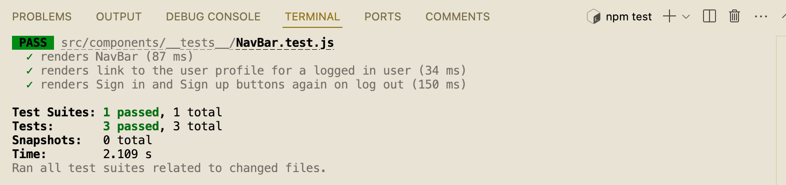
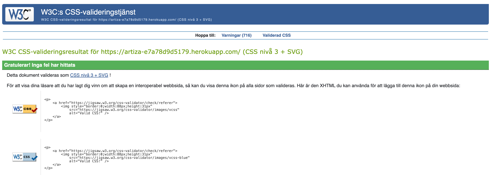
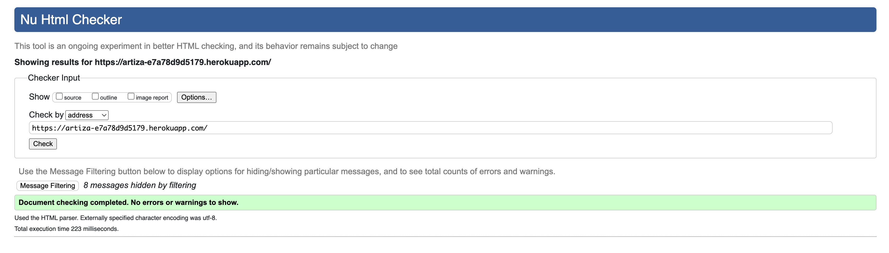
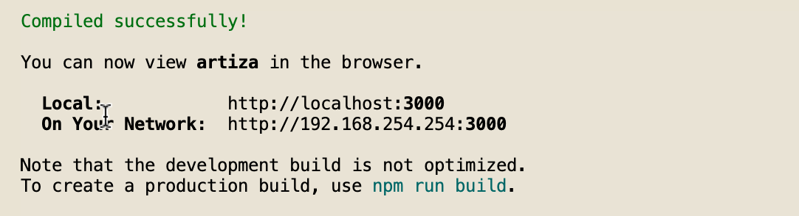

# ARTiza
## Table of Contents
- [UX](#ux)
    - [Site Purpose](#site-purpose)
    - [Site Goal](#site-goal)
    - [Audience](#audience)
    - [Communication](#communication)
    - [Current User Goals](#current-user-goals)
    - [New User Goals](#new-use-goals)
- [User Stories](#user-stories)
    - [User Stories List](#user-stories-list)
    - [User Stories and Issues](#user-stories-and-issues)
    - [Milestone List](#milestone-list)
    - [MoSCoW Prioritization](#moscow-prioritization)    
    - [GitHub Kanban Board](#github-kanban-board)   
- [Design](#design)
    - [Wireframes](#wireframes)
    - [Database Scheme](#database-scheme)
    - [Colour Scheme](#colour-scheme)
    - [Typography](#typography)
- [Features](#features)
    - [Existing Features](#existing-features)
    - [C.R.U.D](#c.r.u.d)
- [Testing](#testing)
    - [Manual Testing](#manual.testing)
    - [Automated Testing](#automated-testing)
    - [Validator Testing](#validator-testing)
    - [Bugs](#bugs)
    - [Unfixed Bugs](#unfixed-bugs)
- [Technologies Used](#technologies-used)
    - [Main Languages Used](#main-languages-used)
    - [Frameworks, Libraries & Programs Used](#frameworks-libraries-&-programs-used)
    - [Databases Platform and Cloud Storage](#databases-platform-and-cloud-storage)
- [Components](#components)
    - [Contexts](#context)
    - [Hooks](#hooks)
    - [Utils](#utils)
- [Deployment](#deployment)
    - [Running the project by using Gitpod](#running-the-project-by-using-gitpod)
    - [Deploying with Heroku](#deploying-with-heroku)
    - [Connecting Frontend to the API](#connecting-frontend-to-the-api)
    - [Final Deploy to Heroku](#final-deploy-to-heroku)
    - [Cloning and Forking](#cloning-and-forking)
- [Credits](#credits)
    - [Content](#content)
    - [Media](#media)
    - [Acknowledgements](#acknowledgements)

## UX

### Site purpose:

The purpose of ARTiza is to provide a dynamic online community for artists, facilitating seamless interaction among users through various features such as art sharing, liking, commenting, and following other enthusiasts

### Site Goals:

The primary goal of ARTiza is to create and keep an engaging and user-friendly platform where artist of all levels can connect, share their artwork and receive feedback through likes and comments. The platform aims to provide a space where both inspiration and creativity can flow, while artists can showcase their work and network with like-minded people in the art world.

### Audience:

The target audience for ARTiza includes artist enthusiasts of all skill levels, from amateur artist looking to improve their skills to professional artist seeking to showcase their work and network with peers.

### Communication:

ARTiza communicates its purpose and features through intuitive design, clear navigation and informative content. The user interface is designed to, increase user engagement and participation, be visually appealing and easy to navigate, with clear prompts that guide users to key functions such as;

* posting arts, 
* bookmarking others posts and find these under their own bookmarks, 
* going to a specific category and finding related posts 
* commenting on others posts

### Current User Goals:

* Share artwork and receive feedback from the community.
* Connect with fellow artist and build a network of like-minded individuals.
* Find inspirations from other fellow artists


### New User Goals:

* Easily sign up and create a profile to start engaging with the community.
* Quickly understand the platform's features and how to navigate them.
* Find inspiration and develope new artist skills through the platform.
* Feel welcomed and encouraged to participate in community and discussions that the site has to offer.

[Back to top](#table-of-contents)

## User Stories

### User Stories List:

A full list of User stories can be found [HERE](https://github.com/Linnea87/artiza/blob/main/src/docs-readme/USERSTORIES.md)

### User Stories and Issues

Project tasks were organized into user stories, each corresponding to specific functionalities or improvements. These user stories were then translated into GitHub issues, and organized into 9 different EPICS

My Issues can be found [HERE](https://github.com/Linnea87/artiza/issues?q=is%3Aopen+is%3Aissue)

### Milestone List:

To get an overview of what I need to do, I organized my EPICS into 9 different Milestones. In this way, I could focus on one EPIC and associated User Stories at a time

My Milestones can be find [HERE](https://github.com/Linnea87/artiza/milestones)

### MoSCoW Prioritization:

The MoSCoW method was employed to prioritize project requirements and features based on their importance.

### GitHub Kanban Board:

The GitHub Kanban board was leveraged to visualize and manage the project's workflow. It facilitated the organization of tasks, from backlog to completion, providing a visual representation of the project's status. 

My Kanban Board can be find [HERE](https://github.com/users/Linnea87/projects/12)

[Back to top](#table-of-contents)

## Design

### Wireframes: 

A separate document for the wireframes can be viewed here:

* [For Desktop view](https://github.com/Linnea87/artiza/blob/main/src/docs-readme/wireframes/wireframes-desktop.pdf)
* [For Mobile view](https://github.com/Linnea87/artiza/blob/main/src/docs-readme/wireframes/wireframes-mobile.pdf)

### Database Schema:

This has been uploaded to the Backend README, which can be found [HERE]()

### Colour Scheme:

I created the color scheme using the [Coolors](https://coolors.co) image picker, where I uploaded my logo and generated these colors;


[Back to top](#table-of-contents)

### Typography:

All fonts were obtained from the Google Fonts library. I chose the following fonts for the page:

"Playfair Display", sans-serif

## Testing

### Bugs

The errors that appeared were due to misspellings, missed commas and wrongly reversed links between the apps. 

This was solved by the fact that when there was an error, I read in the terminal, and corrected what was missed such as misspellings, missed the comma and corrected so that the apps linked correctly to each other

### Unfixed Bugs

* No unfixed bugs found.

Feedback errors such as these from the API are expected. Here are the examples that are absolutely fine:

* three 401s on mount when not logged in,

* 401 error when going to sign up/ sign in page, which happens when we check if we need to redirect a logged in user away from these pages.

* A 401 error when providing incorrect form input such as submitting the sign in form without entering a username.

* And 401 error when an access token has expired, it is refreshed in the background and the request eventually succeeds.

[Back to top](#table-of-contents)

## Technologies Used

### Main Languages Used

* HTML5

* CSS3

* Javascript

* Python

* SQL - Postgres

### Frameworks, Libraries & Programs Used

* GitPod: Served as the primary workspace for project development, facilitating the creation and modification of JSX/*

* CSS files before repository submission on GitHub.

* GitHub: Used as the hosting platform to store the project repository for version control.

* Google Fonts: Utilized for the site fonts.

* Font Awesome: Integrated to incorporate stylish icons into social links within the footer and navigation sections.

* Balsamiq: Was used to create mockups of the project prior to starting.

* Am I Responsive?: Ensured the responsiveness of the project across various devices, ensuring optimal user experience regardless of screen size or resolution.

* Coolors.co: Used to create color palettes tailored to the project's website, ensuring harmonious design.

* Favicon: To provide the code & image for the icon in the tab bar.

* Canva: Utilized for creating image icons, such as uploading an image, no results found and 404 Page Not Found.

* Django: Used to build the backend database that serves as an API for the front-end project.

* React-Bootstrap: The styling library that has aided to the layout of the site, and which was introduced to us during the course of the program.

* ReactJS: To build the components that would collectively form the front-end application.

* jwt-decode: is an open standard (RFC 7519) for securely transmitting information between parties as JSON object.

* NPM JS - The npm registry website used for information on npm libraries.

* react-router-dom: enables you to implement dynamic routing in a web app.

* react-infinite-scroll-component: a technique that automatically adds the next page as the user scrolls down through content, more content is loaded.

* Popper: is used for positioning and aligning pop-up elements, such as dropdown menus, tooltips, or popovers, relative to their reference elements.

## Databases Platform and Cloud Storage

* ElephantSQL Postgres: database service provided by ElephantSQL for data storage.

* Heroku Postgres: SQL database service provided directly by Heroku for storing data.

* Cloudinary: to store images and static files in production.

* Heroku: to deploy and run the application in production.

[Back to top](#table-of-contents)

## Components

Several components have been implemented within this project that have been reused throughout the project:

* axiosDefault.js: for ease of communication with the backend API.

* Asset.js: dynamically renders a loading spinner (spinner), an image (src), and a message (message) throughout the site.

* MoreDropdown.js: to allow users to edit/delete their Events, Posts and comments.

* NavBar.js: renders a navigation bar with various icons and links based on the user's authentication status. The navigation bar also contains sign-in and sign-up links for logged-out users and profile-related links for logged-in users. Additionally, it handles sign-out functionality.

* NotFound.js: renders a custom 404 error page when a user navigates to a non-existent page.

### Contexts

* CurrentUserContext.js: Provides hooks (useCurrentUser and useSetCurrentUser) for accessing and updating the current user's data. Confirm users logged-in status to determine what functionality is - available to the user.

* ProfileDataContext.js: It provides hooks (useProfileData and useSetProfileData) for accessing and updating profile data, respectively. Offering the un/follow ability to other users across PopProf & ProfPage components.

### Hooks

* useClickOutsideToggle.js: manages the state of an element's visibility based on clicks outside of that element.

* useRedirect.js: redirects users based on their authentication status. It sends a POST request to refresh tokens and redirects to the home page ("/") if logged in or logged out.

### Utils
* utils.js: contains helper functions for managing pagination (fetchMoreData), updating follower counts and following status (followHelper and unfollowHelper), and handling authentication tokens (setTokenTimestamp, shouldRefreshToken, removeTokenTimestamp). These functions streamline data management and authentication tasks within the Moments WalkThrough Project.

## Deployment

### Running the project by using Gitpod:

1. Go to the [project repository](https://github.com/Linnea87/artiza)

2. Click the green button that says "Gitpod" and the project will now open up in Gitpod.

### Deploying with Heroku:

I followed the below steps using the Code Institute tutorial:


1. Go to [Heroku.com](https://.heroku.com) and log in; if you do not already have an account then you will need to create one.

2. Click the `New` dropdown and select `Create New App`.

3. Enter a name for your new project, all Heroku apps need to have a unique name, you will be prompted if you need to change it.

4. Select the region you are working in.

In the Deploy tab:

1. Connect your Heroku account to your Github Repository following these steps:

    * Click on the `Deploy` tab and choose `Github-Connect to Github`.
    * Enter the GitHub repository name and click on `Search`.
    * Choose the correct repository for your application and click on `Connect`.

2. You can then choose to deploy the project manually or automatically, automatic deployment will generate a new application every time you push a change to Github, whereas manual deployment requires you to push the `Deploy Branch` button whenever you want a change made.

3. Once you have chosen your deployment method and have clicked Deploy Branch your application will be built and you should now see the `View button`, click this to open your application.

The site was deployed to Heroku. The steps to deploy are as follows:

1. Launch the gitpod workspace.

2. Install ReactJS:
            
    ```
    npx create-react-app . --use-npm
    npm start
    ```

3. Install the following packages using the command npm install:
        
    ```
    react-bootstrap@1.6.3 bootstrap@4.6.0
    react-router-dom@5.3.0
    axios
    react-infinite-scroll-component
    msw --save-dev
    jwt-decode
    -g eslint
    ```
    
4. Git add, commit, and push changes to gitpod.
    
5. Create the project app on Heroku, and link the GitHub repository by navigating to the 'Deploy' tab.

### Connecting Frontend to the API:

1. Navigated to the Heroku app of the project pp5-drf-api, and under the Settings tab, added the following configvars:

    * Key: `CLIENT_ORIGIN` | Value: https://react-app-name.herokuapp.com
    * Key: `CLIENT_ORIGIN_DEV` | Value: https://gitpod-browser-link.ws-eu54.gitpod.io

2. Check that the trailing slash `\` at the end of both links has been removed, and save the configvar pairs.

3. Install the Axios package, & create supporting `axiosDefaults.js` as shown in [Moments Walkthrough](https://github.com/Code-Institute-Solutions/moments/blob/cf955d2f2e6f70f61c92d1f9de85558d8e49f3a8/src/api/axiosDefaults.js).

### Final Deploy to Heroku:

1. In the `scripts` section of `package.json` in gitpod, added the following command:
    ```
    "heroku-prebuild": "npm install -g serve",
    ```

2. Add Procfile to project root & populate with the following:
    ```
    web: serve -s build
    ```

3. Repeat the steps of git add/commit/push.

4. Deploy the project via the deploy button on Heroku.

### Cloning and Forking:

If you want to clone or fork this project, you can do it from my [GitHub repository](https://github.com/Linnea87/artiza).

Keep in mind that this is only the front-end and you will need a back-end to run this application.

Take a look at the [artiza-api repository](https://github.com/Linnea87/artiza-api), for more information on how to set that up.

You should start by setting up a virtual environment, to avoid conflicts and other potential issues.

**Cloning** the project means you are creating a local copy of the project on your own machine.

This enables you to make changes without affecting the original repository.

**Forking** it means you are creating a copy of the project on your own GitHub account,

which gives you the ability to propose changes to the original project,

or just develop your own modified version of it.

Since this project uses npm, it is good practice you do the same.

Make sure you are in the root directory, then run npm install

In the src directory, open axiosDefaults.js and change axios.defaults.baseURL to your own API url.

[Back to top](#table-of-contents)

## Testing

### Manual Testing:

A separate document for testing can be viewed here: [TESTING.md](https://github.com/Linnea87/artiza/blob/main/src/docs-readme/TESTING.md)

### Automated Testing

Automated tests for the NavBar were run on the project using the React Testing Library, following the approach demonstrated in the Moments Walkthrough Project.

<details> 
<summary>React Library Test NavBar Image</summary>


</details>
  
  
### Validator Testing:

1. CSS files pass through the [W3C Jigsaw](https://jigsaw.w3.org/css-validator/validator?uri=https%3A%2F%2Fartiza-e7a78d9d5179.herokuapp.com%2F&profile=css3svg&usermedium=all&warning=1&vextwarning=&lang=sv) validator with no issues found.

    <details> 
    <summary> CSS Validation Image</summary>

    
    </details>
    <br>

2. All HTML files passed through the [W3C Markup](https://validator.w3.org/nu/?doc=https%3A%2F%2Fartiza-e7a78d9d5179.herokuapp.com%2F) Validator with no errors.

    <details>
    <summary>MarkUp Validator Image</summary>

    
    </details>
    <br>

3. All JSX code pass through `npx eslint src/**/*.js` [ESLint](https://eslint.org/). All console.log(err); have been left in place and commented out, as it was suggested in the "Moments" Walkthrough Project.

    <details>
    <summary>ESLint Terminal Results Image</summary>

    
    </details>
    <br>
        

4. Lighthouse

  

    <details>
    <summary>Lighthouse Validator Image</summary>

    
    </details>
    <br>

[Back to top](#table-of-contents)

